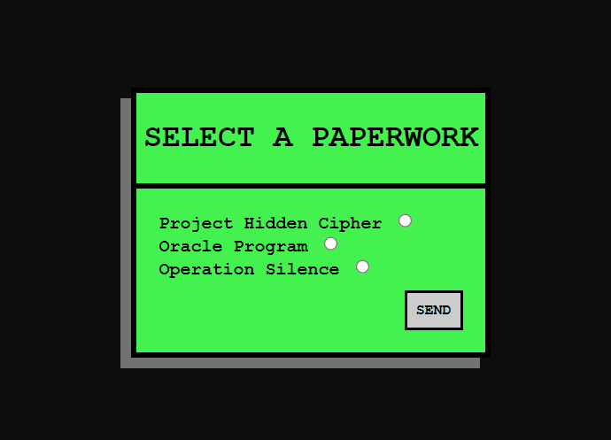

# Prueba Técnica Nº 2 - Java Avanzado

Esta prueba técnica evalua mis conocimientos en Java y Java Web, incluyendo sintaxis, estructuras repetitivas, estructuras selectivas, manejo de colecciones y operaciones CRUD, utilizando JPA para interactuar con una base de datos relacional, JSP para interactuar con el usuario y programación funcional como complemento.

## Contenidos
1. [Funcionalidades Principales](#funcionalidades-principales)
2. [Uso del Programa](#uso-del-programa)
3. [Base de datos](#base-de-datos)
5. [Supuestos](#supuestos)

## Funcionalidades Principales
> Este es un proyecto secreto para administrar los turnos de los usuarios en una entidad gubernamental secreta y discreta de los años de WindowsXP.

- **Iniciar la Aplicación :** Presionar el boton "PRESS TO START" y da inicio al progama, creando el Admin y los tramites que se pueden elegir.
- **Registro :** Permite al usuario introducir sus datos, cabe destacar el numero secreto, unico para cada usuario.  
- **Añadir turno al registrarse :** Añade un turno para un tramite especifico  a elección del usuario.  
- **Añadir turno al iniciar sesión :** Permite al usuario hacer login con su numero secreto para elegir turno para otro tramite.  
- **Sesión del Admin :** Al loggearse el administrador tiene acceso a settear el estado del turno.  
- **Mostrar lista de turnos para usuarios:** Muestra la lista de turnos y permite el filtrado por fecha y estado.
- **Mostrar lista de turnos para admin:** Muestra la lista de turnos y permite el filtrado por fecha y estado. Además permite el filtrado de los "jovenes talentosos" es decir los menores de edad.
- **Salir :** Finaliza la ejecución del programa.

[Volver Arriba](#prueba-técnica-nº-2---java-avanzado)

## Uso del Programa

> Solo pueden acceder los usuarios que tienen un numero secreto que es individual y no se repite entre los miembros, si se intenta entrar con un numero de usuario que no es el tuyo "ya esta en el sistema" le podremos ver por la web cam y será avisado. Una vez registrado podra sacar tanto turnos como desee logeandose con su numero secreto y tendra acceso a una lista donde podrá ver información básica de sus compañeros.
> Por otro lado, el administrador podrá editar el estado de su turno.

### 1. Inicio

### 2. Listado de turnos con opción a filtrar datos

### 3. Sing Up y Login

Registro y loggeo

### 4. Seleccionar Turno

### 5. Sing Up no deseado (ya existente)

Le observaremos por la web cam, eliminaremos el registro tanto en web como en vida.

### 6. Funciones de Administrador@

El admin puede ver la lista de turnos y cambiar el estado de esperando a atendido y viseversa.
Tambien puede hacer dos tipos de filtrado. El filtrado que tienen los usuarios más uno especifico para detectar más rapido a los reclutas menores de edad que han accedido a esta proyecto secreto y darles un trato especial. Se podra refrescar la lista con el boton "REFRESH LIST".Esto es util para ver los cambios de estado o eliminar los filtros, teniendo de nuevo la lista completa y actualizada.

### 7. ¿Y si no existo y loggeo?

Será avisad@ y podrá tener la oportunidad de volver a intentarlo.

### 8. Return

Acceder al menú principal.

[Volver Arriba](#prueba-técnica-nº-2---java-avanzado)

## Base de datos
> En el archivo SQL esta comentado la inserción de unos datos base para probar el filtrado.

| Tabla        | Relación                       |
| ------------ | ------------------------------ |
| secretuser   | Bidireccional con appointment  |
| appointment  | Unidireccional con paperwork    |
| paperwork    |                                |

  

[Archivo SQL](https://github.com/JeinyC/JeinyCharlotteMaldonadoNi-o_pruebatec2/blob/main/AppointmentApp/src/main/resources/SQL/appointment.sql)

[Volver Arriba](#prueba-técnica-nº-2---java-avanzado)

## Supuestos
> Condiciones o premisas bajo las cuales se espera que funcione correctamente el software.

- Que al añadir un turno se añade la fecha actual.
- Que el ADMIN puede entrar a cambiar el estado de los turnos ingresando con el numero secreto **321**.
- Que el numero secreto es unico.
- Que al ser una entidad secreta por defecto ya tiene solo 3 tramites.
- Que esta entidad acepta a jovenes talentos por ello se pide la edad al registrarse.
- Que el usuario va a hacer correcto uso de los botones *"EXIT"* *"RETURN"*.
- Que un turno puede estar en espera y cambiar a atendido y volver a espera por que cada turno puede tener varias fases de atención.
- NINGUN USUARIO SERÁ ELIMINADO, UNA VEZ DENTRO NO HAY ESCAPATORIA. (A no ser que se reinicie la base de datos...)

[Volver Arriba](#prueba-técnica-nº-2---java-avanzado)

